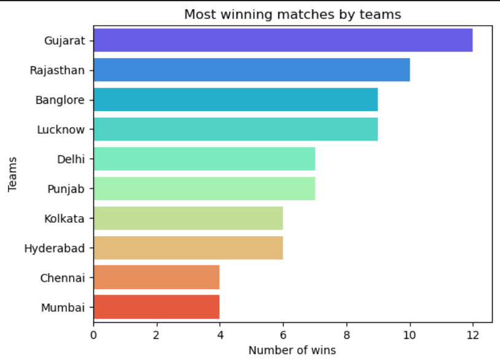
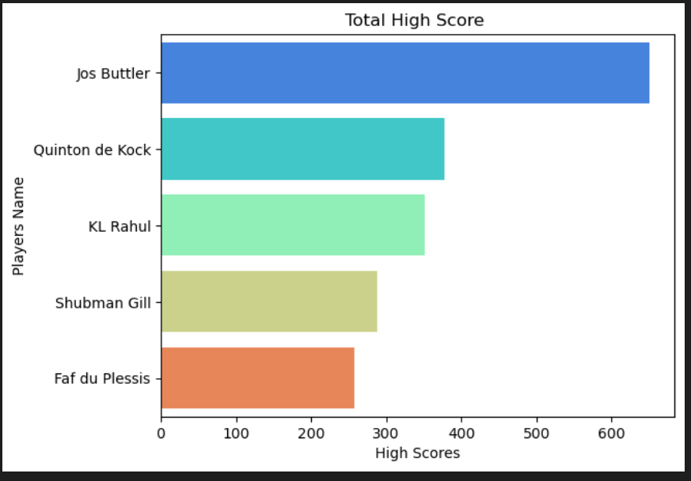
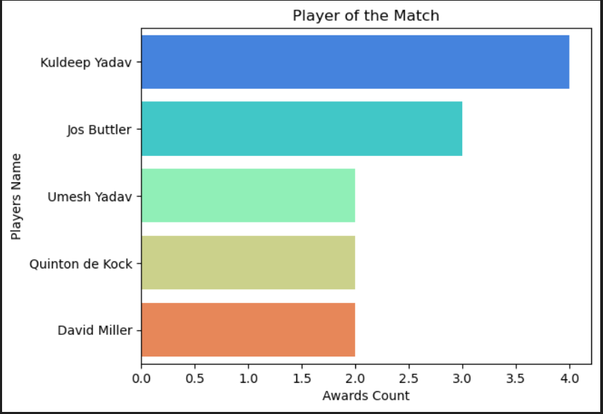
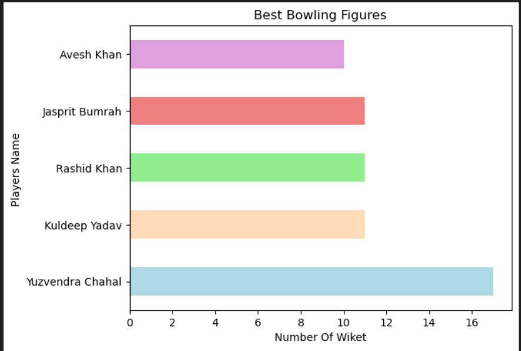

# 🏏 IPL 2022 Data Analysis Project

---

## 1) Project Title

**IPL 2022 Data Analysis – Player & Performance Insights**

---

## 2) Summary

This project performs **Exploratory Data Analysis (EDA)** on IPL 2022 cricket data to evaluate player performance. Using Python and visualization techniques, the analysis identifies top scorers, compares player contributions, and presents insights in a structured, business-oriented format.

---

## Table of Contents

- [Problem Statement](#4-problem-statement)
- [Dataset](#5-dataset)
- [Tools and Technologies](#6-tools-and-technologies)
- [Methods](#7-methods)
- [Key Insights](#8-key-insights)
- [How to Run This Project](#9-how-to-run-this-project)
- [Project Structure](#10_Project_Structure)
- [visulizations](#11-Project-Visualizations)
- [Results and Conclusion](#12_Results_and_Conclusion)
- [Author and Contact](#author-and-contact)

---

## 3) Overview

The project demonstrates an end-to-end data analysis workflow, starting from data inspection and aggregation to insight generation. It showcases how raw sports data can be transformed into **meaningful insights** using Python libraries commonly used by data analysts.

---

## 4) Problem Statement

The objective of this project is to answer key analytical questions such as:

- Which players performed consistently well during IPL 2022?
- Who recorded the highest individual and total scores?
- How do player contributions compare across matches?

---

## 5) dataset

The dataset contains IPL 2022 match-level and player performance data, including match details, team information, innings scores, and key individual performances. It is used to analyze match outcomes and player contributions through exploratory data analysis.

- IPL 2022 match and player-level dataset
- Key columns include:
  - Player Name
  - Team
  - Match-wise Scores
  - Highest Score

_The dataset is used for educational and analytical purposes only._

---

## 6) Tools and Technologies

- **Python**
- **Jupyter Notebook**
- **Pandas** – data manipulation and aggregation
- **NumPy** – numerical operations
- **Matplotlib** – data visualization
- **Seaborn** – statistical visualization

---

## 7) Methods

- Data inspection and basic cleaning
- Exploratory Data Analysis (EDA)
- Player-wise and team-wise aggregations using `groupby`
- Descriptive statistical analysis
- Bar chart visualizations for comparison

---

## 8) Key Insights

- Identified top-performing players based on cumulative and individual scores
- Clear performance differences observed among leading scorers
- Visual comparisons helped communicate insights effectively

---

## 9) How to Run This Project

```bash
# Clone the repository
git clone <repository-url>

# Navigate to the project folder
cd IPL-2022-Data-Analysis

# Open the notebook
jupyter notebook IPL-2022.ipynb
```

---

## 10 )Project Structure

IPL-2022-Data-Analysis/
├── data/
│ └── ipl_2022.csv
├── notebooks/
│ └── IPL-2022.ipynb
├── images/
│ └── charts.png
├── README.md
└── requirements.txt

---

## 11) Project Visualizations

### Most winning matches by teams



### Top Scorers Analysis



### Player of the Match



### Best Bowling Figures

## 

## 12) Results and Conclusion

## The analysis successfully identified **top-performing players** and highlighted key scoring trends from the IPL 2022 season. Using exploratory data analysis and aggregation techniques, the project transformed raw match data into clear performance insights. The results demonstrate how structured EDA and visualization can effectively support data-driven evaluation of player contributions.

## Author and Contact

**Supesh**
Data Analyst | Python | Pandas | NumPy | Matplotlib | Seaborn | SQL | Power BI | Excel

📧 Email:supeshmurhekar993@gmail.com
🔗 LinkedIn: https://www.linkedin.com/in/supesh-murhekar-792b45253/

```

```
